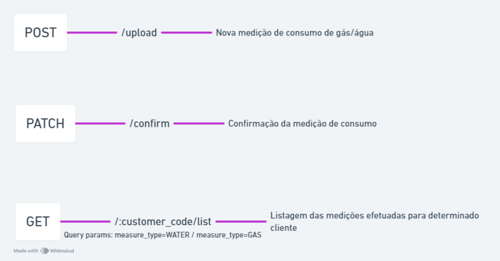

# Measure Backend

## Descrição

-   Aplicação backend desenvolvida utilizando do framework Express com TypeScript que gerencia a medição de consumo de água e gás dos usuários.
-   A leitura dos valores é efetuada utilizando de Inteligência Artificial (Google Gemini API) para a obtenção de valores a partir de uma imagem compartilhada pelo usuário.
-   Projeto desenvolvido utilizando Docker e Docker Compose de forma a permitir uma escalibilidade mais eficaz e um desenvolvimento mais eficiente utilizando containers;
-   A aplicação implementa a validação e serialização de dados utilizando a biblioteca Zod;
-   Gerenciamento de banco de dados com Prisma ORM;
-   Projeto estruturado visando a escalabilidade e melhor manutenção do código. Para isso foi utilizado o padrão de design de software MVC (model-view-controller) e injeção de dependências;
-   Utilização de logs customizados para melhor manutenção do código.

## Tecnologias utilizadas

-   [Express](https://expressjs.com/): Framework Node.js;
-   [Prisma](https://www.prisma.io/): ORM utilizado para gerenciamento do banco de dados;
-   [Docker](https://docs.docker.com/) e [Docker Compose](https://docs.docker.com/compose/): Plataforma para criação e gerenciamento de aplicações em containers;
-   Helmet: Middleware para implementação de segurança da aplicação;
-   [Zod](https://zod.dev/): Validação e serialização de dados;
-   Google Gemini: Modelo de IA;
-   TypeScript: Linguagem de programação utilizada.

## Funcionalidades da aplicação

1. Medição do consumo de água ou gás:
    - Após o recebimento da imagem do medidor de consumo proveniente da aplicação cliente, é efetuada uma interação com a Google Gemini API de forma a obter a medição através da imagem disponibilizada pelo client;
    - A medição obtida é retornada à aplicação client para conferência, confirmação ou correção do valor lido. Com a medição confirmada/corrigida os dados são armazenados no banco de dados da aplicação.
2. Leitura das medições realizadas por determinado cliente:
    - Por meio do código de identificação do cliente é possível listar todas as medições realizadas para esse determinado cliente. Adicionalmente é possível filtrar a listagem levando em consideração o tipo de serviço medido (água ou gás)

## Pré-requisitos

-   [Git](https://git-scm.com/)
-   [Docker Desktop](https://www.docker.com/)

## Clonando o projeto

```bash
git clone <github template url> <project_name>
```

## Variável de ambiente

Copie o arquivo '.env.example' e o renomeie para '.env'. Substitua o valor da variável de ambiente presente no arquivo, para o valor de sua credencial.

Esse projeto utiliza a seguinte variável de ambiente:

| Nome           | Descrição                           | Obrigatório |
| -------------- | ----------------------------------- | ----------- |
| GEMINI_API_KEY | Chave para conexão com a Gemini API | [x]         |

## Inicializando a aplicação com Docker

Inicializando a aplicação com Docker:

```bash
cd <project_name>
docker compose up
```

Navegue até `http://localhost:3000` para acessar a URL base da API.

Para parar a aplicação e remover os containers, abra um novo terminal e no diretório raiz do projeto utilize o comando:

```bash
docker compose down
```

## Rotas da aplicação

### Diagrama de rotas



### POST /upload

Obter a medição através do envio da imagem do medidor de consumo.

Padrão de corpo da requisição:

```json
{
    "customer_code": "6d774c03-b08f-4ee9-942f-7644beaefd4b",
    "measure_datetime": "2010-01-05T03:00:00.000Z",
    "measure_type": "GAS ou WATER",
    "image": "base64"
}
```

Padrão de resposta da requisição:

-   Status 200 - OK:

```json
{
    "measure_uuid": "6d774c03-b08f-4ee9-942f-7644beaefd4b",
    "measure_value": 500,
    "image_url": "image_url"
}
```

-   Status 400 - BAD REQUEST:

```json
{
    "error_code": "INVALID_DATA",
    "error_description": {
        "customer_code": ["Required"],
        "measure_datetime": ["Required"],
        "measure_type": ["Required"],
        "image": ["Required"]
    }
}
```

-   Status 409 - CONFLICT:

```json
{
    "error_code": "DOUBLE_REPORT",
    "error_description": "Leitura do mês já realizada"
}
```

### PATCH /confirmação

Confirmação ou correção do valor lido.

Padrão de corpo da requisição:

```json
{
    "measure_uuid": "ae2d6896-c52e-46bd-868e-740d3212d1fd",
    "confirmed_value": 500
}
```

Padrão de resposta da requisição:

-   Status 200 - OK:

```json
{
    "success": true
}
```

-   Status 400 - BAD REQUEST:

```json
{
    "error_code": "INVALID_DATA",
    "error_description": {
        "measure_uuid": ["Required"],
        "confirmed_value": ["Required"]
    }
}
```

-   Status 404 - NOT FOUND:

```json
{
    "error_code": "MEASURE_NOT_FOUND",
    "error_description": "Leitura do mês já realizada"
}
```

-   Status 409 - CONFLICT:

```json
{
    "error_code": "CONFIRMATION_DUPLICATE",
    "error_description": "Leitura do mês já realizada"
}
```

### GET /:customer_code/list

```
Query params disponíveis:
- measure_type=WATER
- measure_type=GAS
```

Listagem das medições efetuadas para determinado cliente.

Não há a necessidade de envio de corpo na requisição.

Padrão de resposta da requisição:

-   Status 200 - OK:

```json
{
    "customer_code": "y032703e-3112-4b15-877a-99c8662be7f5",
    "measures": [
        {
            "measure_uuid": "e032703e-3112-4b15-877a-99c8662be7f5",
            "measure_datetime": "2010-01-05T01:00:00.000Z",
            "measure_type": "WATER",
            "has_confirmed": false,
            "image_url": "image_url"
        }
    ]
}
```

-   Status 400 - BAD REQUEST:

```json
{
    "error_code": "INVALID_TYPE",
    "error_description": "Tipo de medição não permitida"
}
```

-   Status 404 - NOT FOUND:

```json
{
    "error_code": "MEASURES_NOT_FOUND",
    "error_description": "Nenhuma leitura encontrada"
}
```
